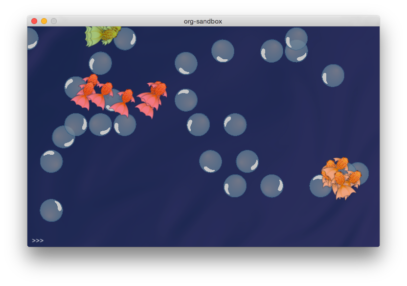

org-sandbox
===========

**org-sandbox** is an attempt at creating a sandbox environment filled with organisms and energy sources. Organisms are each initialized with a random neural network that is continuously fed with input from their current location within the sandbox. Output from each individual's neural network determines how the organism responds and navigates.

Organisms that maintain contact with energy sources can survive and replicate themselves and their specific neural network. Those that starve will deplete their energy reserves and die.

### Dependencies

* PyBrain - [http://www.pybrain.org](http://www.pybrain.org/)
* pygame - [http://www.pygame.org](http://www.pygame.org/)
* scipy - [http://www.scipy.org](http://www.scipy.org/)
* numpy - [http://www.numpy.org](http://www.numpy.org/)
* cocos2d - [http://www.cocos2d.org](http://www.cocos2d.org)

===========

===========

===========

